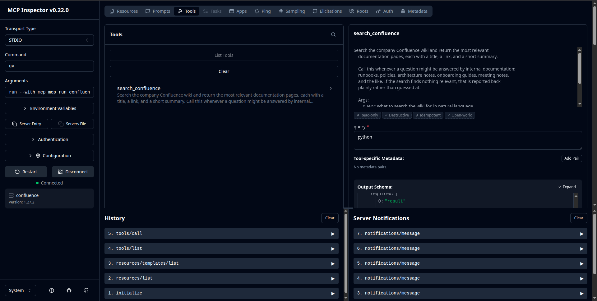

# Confluence MCP Server

This exposes your Atlassian Confluence wiki to any AI assistant that speaks the
**Model Context Protocol (MCP)** — Claude Desktop, Claude Code, Cursor, and a
growing list of others — as a single `search_confluence` tool.

## Why this matters (the plain-English version)

MCP is an open standard for connecting AI assistants to the tools and data a
business already has. Think of it as a universal adapter: instead of building a
custom one-off integration for every AI app, you build **one** MCP server and
every MCP-capable assistant can use it. Anthropic introduced the protocol and it
has since been adopted across the industry, so a server you write today keeps
working as the tools your team uses change.

In practice: a staff member asks their AI assistant a question, the assistant
decides it needs to check internal documentation, and it calls this server to
search Confluence — returning answers with links to the source pages, so nobody
has to take the AI's word for it.

## How this differs from the companion agent sample

The [`confluence_ai_agent`](../confluence_ai_agent) sample is a **complete app**:
it embeds a model, owns the conversation, and calls Confluence itself.

This sample is the **integration layer only**. It contains no model and no AI
API key — the assistant lives in the client. That separation is the whole point
of MCP: the same server plugs into whichever AI tool a client already runs, and
you maintain one integration instead of one per app.

```
┌─────────────────────┐        MCP         ┌──────────────────────┐      HTTPS      ┌────────────┐
│  AI client          │ ◄────────────────► │  this server         │ ◄─────────────► │ Confluence │
│  (Claude Desktop,   │  stdio / JSON-RPC  │  search_confluence   │   API token     │   Cloud    │
│   Claude Code, ...) │                    │  tool                │                 │            │
└─────────────────────┘                    └──────────────────────┘                 └────────────┘
```

## Setup

Run `make setup`, which will:
* Create a Python virtual environment named `.venv`
* Upgrade pip to the latest version
* Install all dependencies from `requirements.txt`

Then copy `.env.example` to `.env` and fill in the values:

| Environment Variable | Description |
| :------------------- | :---------- |
| `CONFLUENCE_URL`     | URL to your Confluence instance, e.g. `https://your-site.atlassian.net/wiki` |
| `CONFLUENCE_USER`    | Email of the Confluence account the API token belongs to |
| `CONFLUENCE_API_KEY` | Confluence API token |
| `SEARCH_LIMIT`       | Max Confluence pages returned per search, e.g. `5` |
| `MCP_TRANSPORT`      | `stdio` (default) or `streamable-http`. See [Transports](#transports) |
| `MCP_HOST`           | Bind address for `streamable-http`, e.g. `127.0.0.1` (default) |
| `MCP_PORT`           | Port for `streamable-http`, e.g. `8000` (default) |
| `DEBUG`              | Optional. Set to any value for verbose logging (logs go to stderr) |

> **Note:** there is no model or AI API key here on purpose — the connecting AI
> client supplies the model.

## Connect it to an AI client

The server talks to clients over **stdio**, so the client launches it as a
subprocess. Point the client at the virtualenv's Python and this script.

### Claude Code

```bash
claude mcp add confluence -- /path/to/confluence_mcp_server/.venv/bin/python \
  /path/to/confluence_mcp_server/confluence_mcp_server.py
```

### Claude Desktop

Add an entry to `claude_desktop_config.json` (Settings → Developer → Edit Config):

```json
{
  "mcpServers": {
    "confluence": {
      "command": "/path/to/confluence_mcp_server/.venv/bin/python",
      "args": ["/path/to/confluence_mcp_server/confluence_mcp_server.py"]
    }
  }
}
```

Restart the client. Ask it something your wiki would answer (e.g. *"What's our
on-call escalation policy?"*) and it will call `search_confluence` and reply
with links to the matching pages.

## Try it without a client

The MCP Inspector launches the server and gives you a browser UI to call the
tool directly — useful for a quick demo or for debugging:

```bash
source .venv/bin/activate
mcp dev confluence_mcp_server.py
```

## Transports

The transport is chosen by the `MCP_TRANSPORT` env var — no code change needed:

- **`stdio`** (default) — the client launches the server as a subprocess and
  talks to it over stdin/stdout. This is what the Claude Code / Claude Desktop
  setup above uses, and what every desktop MCP client supports.
- **`streamable-http`** — the server runs as a long-lived network service that
  remote clients connect to over HTTP. Host it once and share it across a team.

```bash
source .venv/bin/activate
MCP_TRANSPORT=streamable-http MCP_PORT=8000 python confluence_mcp_server.py
# serves at http://127.0.0.1:8000/mcp
```

> The SDK also offers an older `sse` transport, but it is deprecated in favor of
> `streamable-http`, so this server doesn't expose it. Put any network
> deployment behind your own authentication.

## MCP Inspector
`mcp dev confluence_mcp_server.py`



## Notes

- **Read-only:** the server only searches. It never edits or deletes wiki
  content, so it's safe to hand to any assistant.
